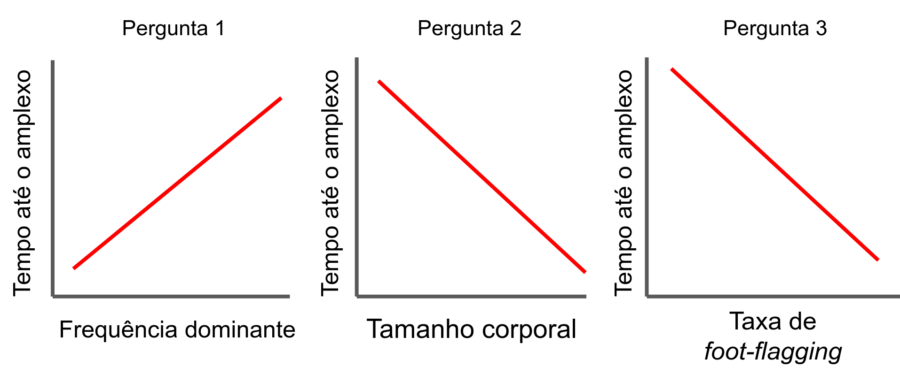

```{r setup, include=FALSE}
knitr::opts_chunk$set(echo = TRUE)
```

# 1. Introdução

<center>


</center>

  Em anuros, o canto de anúncio é aquele emitido por machos para atrair fêmeas ou repelir machos competidores na paisagem acústica (Wells 1977; Duellman & Trueb 1986). A maioria das espécies de anuros apresentam comportamento noturno e portanto são altamente dependentes do canto para se reproduzirem. Contudo, na espécie *Hylodes asper* (Anura: Hylodidae) os machos apresentam comportamento diurno, sedentário e esperam até as fêmeas chegarem nos sítios reprodutivos, onde cantam em superfícies de rochas próximas a águas lóticas (i.e. rios de correnteza intensa ou cachoeiras; Heyer et al. 1990; Haddad & Giaretta 1999). Devido à disponibilidade de luz e ao ruído de fundo das correntezas, sinais visuais podem ser apresentados concomitantemente aos sinais acústicos para maximizar a transmissão de informação entre o macho emissor e as fêmeas ou machos receptores (Hödl et al. 1997). Embora a maioria dos estudos utilize aspectos temporais (e.g. taxa de cantos) ou espectrais (i.e. o quão agudo ou grave o canto é) como variáveis respostas de modelos (e.g. Gingras et al. 2013; Goutte et al. 2016), o tempo em que as fêmeas demoram para chegar nos sítios reprodutivos e iniciarem o amplexo é pouco estudado.

  Existem sinais multimodais compostos por características morfológicas, acústicas e visuais que são consideradas mais atrativas pelas fêmeas e podem explicar o tempo até sua chegada e início do amplexo. Por exemplo, uma possível preditora acústica é a **frequência dominante** do canto (DF: a banda com maior concentração de energia no espectro; Köhler et al. 2017), no qual cantos mais graves são considerados mais atrativos e talvez reduzam o tempo até o início do amplexo, pois machos com canto mais grave geralmente tem cordas vocais mais espessas e compridas (McClelland et al. 1996), o que geralmente é um sinal honesto que informa o tamanho corporal do macho (Wells 2007; Köhler et al. 2017). Contudo, existem machos que mentem! Machos mentirosos são comuns em algumas espécies, os quais conseguem modular a frequência do canto (i.e. deixar mais grave por relaxamento dos músculos da cartilagem aritenóide; Martin 1971; Schmid 1979; Ryan 1988). Por isso, incluir o **tamanho corporal** como uma variável preditora é uma forma de avaliar a honestidade da frequência. Por fim, machos da espécie *Hylodes asper* às vezes cantam ao mesmo tempo em que apresentam um display visual chamado <strong><em>foot-flagging</em></strong>, no qual esticam as pernas para chamarem atenção das fêmeas visualmente devido ao barulho das corredeiras que podem reduzir as chances de serem escutados pelas fêmeas (Heyer et al. 1990; Haddad & Giaretta 1999). Portanto, uma última hipótese é que uma taxa de foot-flagging alta reduza o tempo até as fêmeas iniciarem o amplexo.

# 2. Objetivos e hipóteses

O objetivo geral desse trabalho é responder como sinais multi-modais influenciam o tempo até o início do amplexo em *Hylodes asper*. Os objetivos específicos são entender:

1. Como os sinais espectrais de frequência dominante (DF) influenciam o tempo até o início do amplexo?
- H0: Não há influência da DF sobre o tempo até o início do amplexo
- H1: DF é positivamente relacionada com o tempo até o início do amplexo, de modo que machos com canto mais grave (menor DF) copulam antes (menor tempo até o início do amplexo)

2. Como o tamanho corporal influencia o tempo até o início do amplexo?
- H0: Não há influência do tamanho corporal sobre o tempo até o início do amplexo
- H1: Tamanho corporal é negativamente relacionada com o tempo até o início do amplexo, de modo que machos maiores copulam antes

3. Como os sinais visuais de taxa de *foot-flagging* influenciam o tempo até o início do amplexo?
- H0: Não há influência da taxa de *foot-flagging* sobre o tempo até o início do amplexo
- H1: Taxa de *foot-flagging* é negativamente relacionada com o tempo até o início do amplexo, de modo que machos que dançam mais copulam antes

<center>



</center>

# 3. Simulação de dados

```{r ass.function}
source("R/funcoes_auxiliares.R")
source("R/saposim.R")
```

A cada simução é criada uma nova matriz de <code>espaco</code> de <code>area</code> linhas e <code>area</code> colunas. Em seguida, são sorteadas as posições dos <code>nmacho</code> daquela simulação. A frequência de canto <code>freq</code> (Hz), taxa de footflag <code>foot</code> (footflag/minuto) e tamanho corporal <code>tama</code> (cm) de cada um dos machos é simulada. Estas caracteristicas são sorteadas a partir de uma distribuição que acreditamos ser realiza (normal, poisson e normal, respectivamente) e, em seguida, padronizadas pela função <code>padroniza</code>. Os valores padronizados aparecem no output como <code>freqpad</code>, <code>footpad</code> e <code>tamapad</code>. É esperado que machos mais próximos à cachoeira tenham menor tamanho corporal e vocalizem em frequencias mais agudas (maiores), portanto tenham, em média, probabilidade menor de atrair fêmeas. No entanto, é esperado que esses machos tenham também maior taxa de footflag, o que pode contra-balancear essa esperança. Apesar de estes valores serem correlacionados, as características do macho são sorteadas independentemente de uma distribuição aleatória.
A probabilidade de seleção do macho é então calculada através de uma regressão logistica, 
$$P = \frac{e^{exprlin}}{1+e^{exprlin}}$$ 
com expressão linear de fórmula: $exprlin = a \times tamanho + b \times taxafootflag + c \times DF$ e intercepto igual a média da expressão linear.
Uma cédula vazia é então sorteada para a fêmea ocupar, e esta escolhe um macho para copular com probabilidade <code>prob</code>. A distância <code>distf</code> entre a fêmea e o macho escolhido é calculada pela função <code>dist</code>. A fêmea e o macho são considerados ocupados até o final da simulação e são retirados do <code>espaco</code>. A simulação se repete com <code>nfemea = nmacho</code>. O tempo total <code>ttot</code> o macho ser escolhido também é guardado, sendo definido como a soma de todas <code>distf</code> anteriores na mesma simulação. A função de simulação de sapos, <code>saposim</code> se encontra na íntegra no arquivo "R/saposim.R".

```{r figura, echo=FALSE, fig.align = 'center'}
par(mar = c(0,0,1,0))

#plot vazio
plot(NULL, xlim = c(-2, 12), ylim = c(-2, 12), ann = FALSE, xaxt = "n", yaxt = "n", bty = "n", asp = 1)

#faz grid
segments(x0 = -1:11, x1 = -1:11, y0 = rep(-1, 11), y1 = rep(11, 11))
segments(x0 = rep(-1, 11), x1 = rep(11, 11), y0 = -1:11, y1 = -1:11)

#cria cachoeira
mtext(text = "area = 12", at = 5, side = 3, line = 0)
rect(xleft = 11, ybottom = -2, xright = 12, ytop = 12, col = "lightblue")

#faz labels
text(x = -0.5:10.5, y = 11.5, paste0("C", 1:12), cex = 0.5)
text(x = -1.5, y =  -0.5:10.5, paste0("L", 12:1), cex = 0.5)
text(x = 11.5, y =  5, "cachoeira", cex = 1.5, srt = 270)

#plota machos
text(x = c(3, 10,  2,  1,  2,  7,  9,  6,  0,  3)+0.5, y = c(9,  1,  8,  9,  5,  4,  2,  8, -1, -1)+0.5, paste0("m", 1:10), cex = c(0.58, 0.29, 0.63, 0.52, 0.58, 0.47, 0.51, 0.40, 0.51, 0.7), col = c(rep("black", 9), "blue")) 

#plota femea
text(x = 4.5, y = 5.5, "F", col = "red")

#distancia entre macho escolhido e femea
segments(x0 = 3.5, x1 = 4.3, y0 = -0.5, y1 = 5.5, lty = 2, col = "green")
text(x = 4.15, y = 2.5, "distf = 7.3", col = "green", cex = 0.7)
```
Figura 3 - Uma distribuição hipotética de machos (m1 a m10) e fêmea (F) no espaço. A probabilidade de seleção dos machos está representada pelo tamanho da fonte. Ao lado direito se encontra a cachoeira, que se correlaciona com a probabilidade de seleção. Neste exemplo, o macho "m10" foi escolhido e a sua distancia "distf" foi calculada. 

Além do efeito das características dos sapos, decidimos também investigar se a variação na <code>area</code> da cachoeira é relevante para o tempo até o início do amplexo. Como resultado, apresentamos então duas simulações

* <code>sim_Afix</code> - dimensões da cachoeira (<code>area</code>) fixa em 50.
* <code>sim_Avar</code> - dimensões da cachoeira (<code>area</code>) sorteada de uma distribuição uniforme entre 10 e 100 (arredondada para números inteiros).

Em ambas as simulações foram mantidos os valores padrão, com excessão de <code>nsim</code>, que foi fixado em 10000. Os valores padrão da função são:
* <code>vecarea = round(runif(nsim, 10, 100), 0)</code>
* <code>vecnmacho= vecarea</code>
* <code>cffreq</code> = 1.05
* <code>cftama</code> = 0.5
* <code>cffoot</code> = 0.8

O código das simulações está no documento "R/simula_dados.R". Como <code>nsim</code> é muito grande e leva alguns minutos, salvamos o resultado das simulações como arquivos <code>R.data</code>.

```{r}
load("data/sim1.Rdata") #mudar dps
load("data/sim2.Rdata")
summary(sim1)
summary(sim2)
```


# 4. Analises

Pacotes utilizados
```{r}
library(lme4)
library(MASS)
library(bbmle)
```

## 4.1 Simulação com área fixa

```{r echo=FALSE, fig.align = 'center'}
hist(sim2$ttot)
par(mfrow = c(2,2))
plot(sim2$ttot ~ sim2$prob)
plot(sim2$ttot ~ sim2$footpad)
plot(sim2$ttot ~ sim2$freqpad)
plot(sim2$ttot ~ sim2$tamapad)
par(mfrow = c(1,1))
```

### 4.1.2 GLMM x GLM

```{r eval=FALSE}
glmm0full = glmer(ttot~tamapad*freqpad*footpad + (1|nsim), family = Gamma, data=sim2)

```


## 4.2 Simulação com área variável

### 4.2.1 Análise exploratória
```{r echo=FALSE}
hist(sim1$ttot)
par(mfrow = c(2,2))
plot(sim1$ttot ~ sim1$prob)
plot(sim1$ttot ~ sim1$footpad)
plot(sim1$ttot ~ sim1$freqpad)
plot(sim1$ttot ~ sim1$tamapad)
par(mfrow = c(1,1))
```

### 4.2.2 GLMM x GLM
A principio, acreditamos que o GLMM é mais adequado para nossa estrutura de dados. No entanto, o modelo que gostaríamos de fazer não converge.
```{r eval=FALSE}
# O modelo full nao converge:

glmmfull = glmer(ttot~tamapad*freqpad*footpad*I(area^2) + (1|nsim), family = Gamma, data=sim1)

# Error in pwrssUpdate(pp, resp, tol = tolPwrss, GQmat = GQmat, compDev = compDev,  : 
#   PIRLS loop resulted in NaN value
```

Por esse motivo, comparamos o modelo aleatório mais simples possível, apenas com a probabilidade de seleção dos machos. Pelo funcionamento da simulação, a variável <code>prob</code> deve abarcar toda a informação de <code>freq</code>, <code>foot</code> e <code>tama</code>. No entanto, essa probabilidade não é biologicamente plausível de ser coletada, e usamos aqui apenas para verificar a necessidade do uso do modelo misto.
```{r}
glmmP = glmer(ttot~prob + (1|nsim), family = Gamma, data=sim1)

#Comparando o glmm com o glm:
glmP = glm(ttot~prob, family = Gamma, data=sim1)

#Nao da pra descartar o efeito aleatorio
AICtab(glmmP, glmP)
```

O GLMM é infinitamente melhor que o GLM.

# 5. Resultados

# 6. Discussão

# 7. Referências

Duellman, W. E., & Trueb, L. (1986). Biology of Amphibians McGraw-Hill Inc. Nueva York, EUA.

Gingras, B., Mohandesan, E., Boko, D., & Fitch, W. (2013). Phylogenetic signal in the acoustic parameters of the advertisement calls of four clades of anurans. BMC Evolutionary Biology, 13(1), 1-12.

Goutte, S., Dubois, A., & Legendre, F. (2013). The importance of ambient sound level to characterise anuran habitat. Plos One, 8(10), e78020.

Haddad, C. F., & Giaretta, A. A. (1999). Visual and acoustic communication in the Brazilian torrent frog, *Hylodes asper* (Anura: Leptodactylidae). Herpetologica, 324-333.

Heyer, W. R., Rand, A. S., da Cruz, C. A. G., Peixoto, O. L., & Nelson, C. E. (1990). Frogs of Boracéia. Arquivos de Zoologia, 31(4), 231-410.

Hödl, W., Rodrigues, M. T., Accacio, G. M., Lara, P. H., Pavan, D., Schiesari, L., & Skuk, G. (1997). Foot-flagging display in the Brazilian stream-breeding frog *Hylodes asper* (Leptodactylidae). Scientific film, Ctf, 2703.

Köhler, J., Jansen, M., Rodríguez, A., Kok, P. J. R., Toledo, L. F., Emmrich, M., Glaw F., Haddad, C. F. B., Rodel, M., Vences, M. (2017). The use of bioacoustics in anuran taxonomy: Theory, terminology, methods and recommendations for best practice. Zootaxa, 4251, 1–124.

Martin, W. F. (1971). Mechanics of sound production in toads of the genus Bufo: passive elements. Journal of Experimental Zoology, 176(3), 273-293.

McClelland, B. E., Wilczynski, W. A. L. T. E. R., & Ryan, M. J. (1996). Correlations between call characteristics and morphology in male cricket frogs (Acris crepitans). The Journal of Experimental Biology, 199(9), 1907-1919.

Ryan, M. J. (1988). Constraints and patterns in the evolution of anuran acoustic communication. The evolution of the amphibian auditory system, 637-677.

Schmid, E. (1978). Contribution to the morphology and histology of the vocal cords of Central European anurans (Amphibia). Zoologische Jahrbucher Anatomie, 5, 133-150.

Wells, K. D. (1977). The social behaviour of anuran amphibians. Animal Behaviour, 25, 666-693.